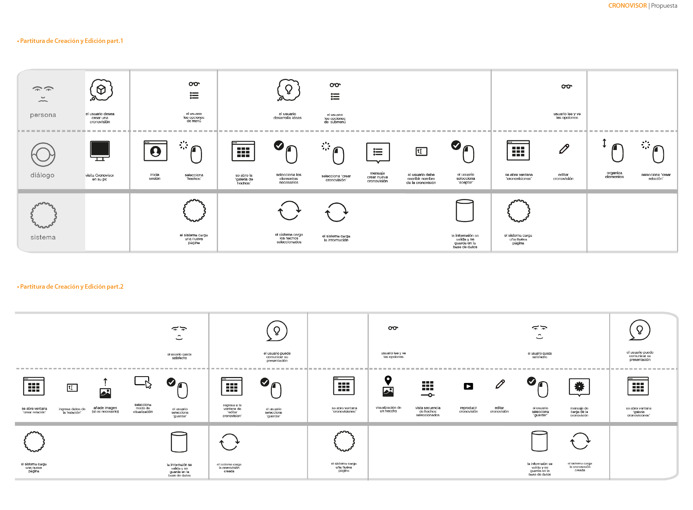

# Mapa de Navegación

El mapa de navegación es un recurso gráfico que permite mostrar la organización de los co- netnidos de la plataforma web en categorías, describe los tipos de categorías y sus contenidos, además de jerarquizar la lectura de estos contenidos.

**Cronovisor:**

Relata las características de la plataforma: Exploración, Organización y Presentación. Invita a la búsqueda que lleva al explorador, enlaza a un tutorial, muestra recursos (guías de aplicación) para que el profesor pueda usar la plataforma en clases y por último una sección de cronovisiones destacadas como buenos ejemplos para quienes recien conoscan la plataforma.

**Explorar:**

El usuario pude seleccionar ver los últimos hechos o personajes agregados a la plataforma, ver las Últmas cronovisones creadas y seleccionar cronovisones por Categorías. Las secciones Hechos Recientes y Personajes Recientes permiten al usuario comenzar y navergar en la plataforma, seleccionar ver por elemento hecho o personajes o verlos por los temas mencionados anteriormente.

**Crear:**

Aquí el usuario debe registrarse o iniciar sesión previamente, permite al usuario comenzar a guardar elementos creando una Cronovision reciente, para luego editarla añadiendo las relaciones, sean estas texto seleccionado, imagen seleccionada o vista de mapa y el order de lectura.

**Perfil:**

Aqui el usuario se registra o inicia sesión, administra sus datos, revisa notificaciones , notas que le dió el profesor a su cronovisón, y ve los grupos a los que pertenece. Permite obtener la sección Cronovisiones para editarlas.

**Cronovisones:**

Donde se guardan las cronovisiones recién creadas, permite su edición.

**Tutoriales:**

Textos y videos que enseñan como navegar, guardar hehos/personajes y crear/editar cronovisiones.

**Noticias:**

Actualizaciones de la paltaforma, mejoras, etc.

 

## Partituras de interacción

Secuencias de acción e interacción del usuario con el proyecto. Aquí se ilustran las distintas maneras en las que el usuario trabajaría, exploraría y crearía las presentaciones con el uso de esta plataforma digital.
Aquí se presenta solamente las partituras de Búsqueda de elementos y la Creación y Edición de presentaciones en la plataforma por ser las interacciones principales de esta.

* 
**Búsqueda**

Aquí el usuario hace uso de las opciones de búsqueda, ingresando un término de búsqueda, al aparecer los datos coincidentes, el usario tiene la opción de especi car la búsqueda por tema y tipo. También buscando los hechos a travez de la barra de tiempo. Al selecciona los hechos y personajes que requiera el sistema pide guardar los datos y dónde los quiere guardar.

* **Creación y Edición
**

Para crrear una cronovisión el usuario debe ingresar a su galería de hechos para seleccionar los que utilizará, darle nombre a la cronovisión. Luego se abre la ventana de cronovisiones, edita los datos de descripción y foto, organiza el orden de los elementos, crea relaciones y selecciona el modo de visualizacion de estos organinzandolos en el orden del relato que quiera.

