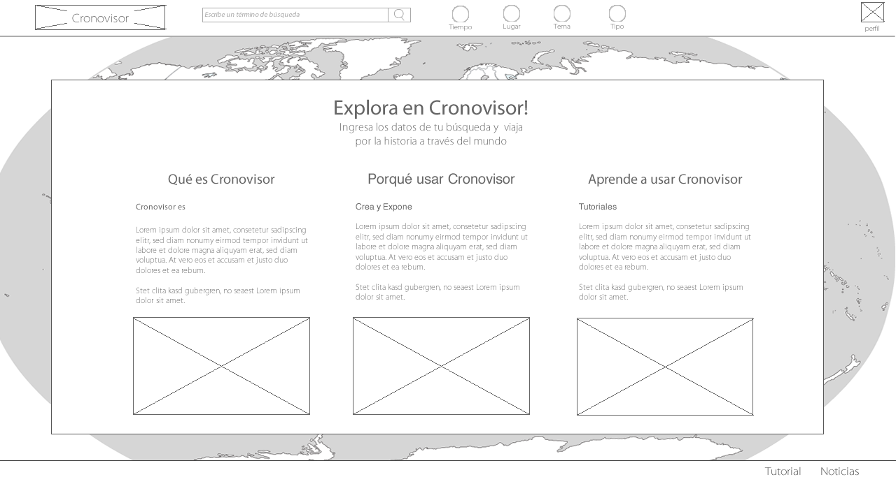
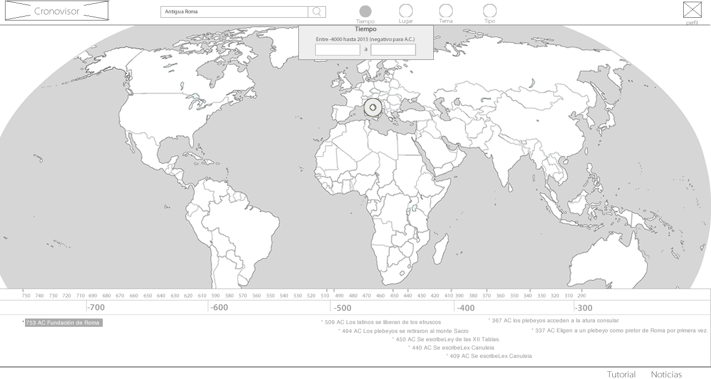
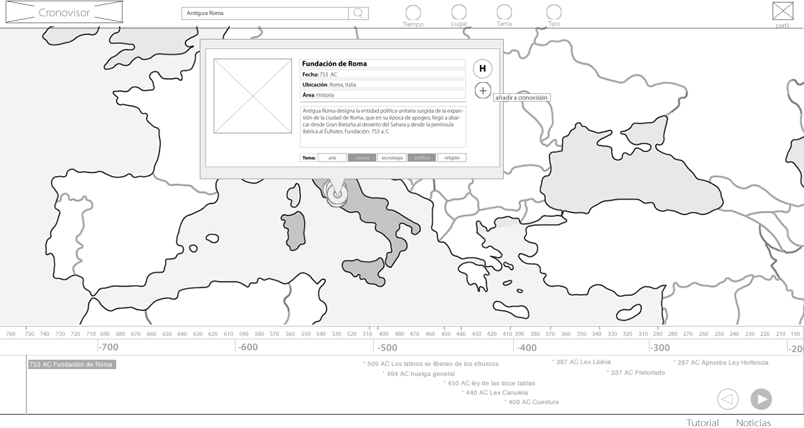
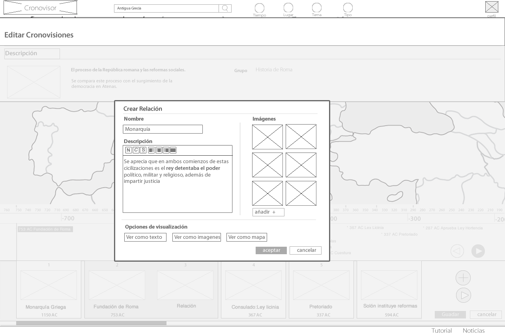
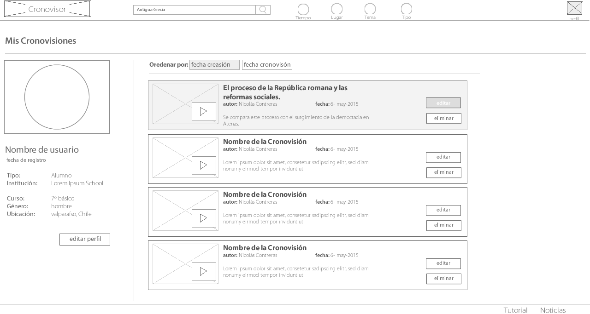
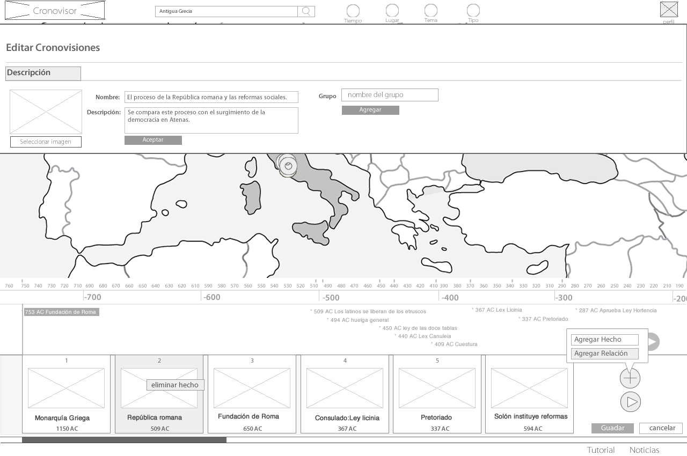
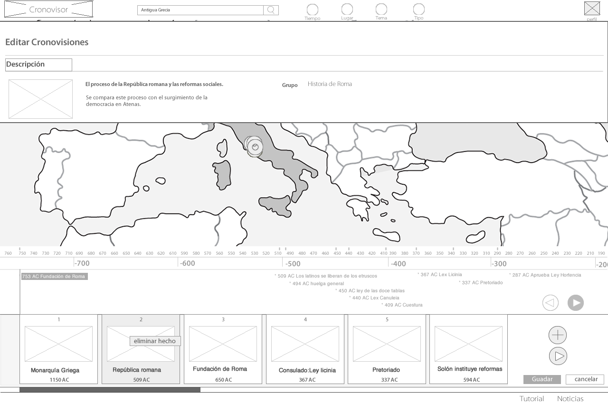
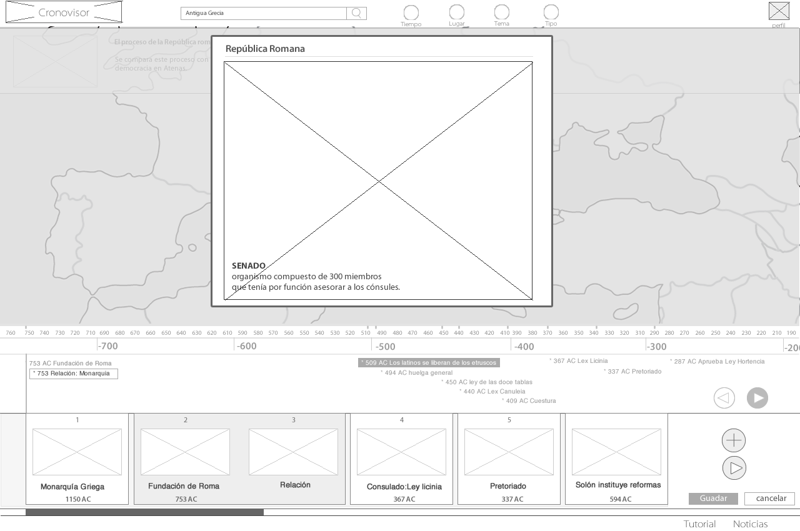

# Wireframes

En la construcción de una plataforma virtual cuyo objetivo es facilitar el aprendizaje de la materia de Historia para alumnos en nivel escolar es fundamental responder las siguientes preguntas: ¿Cómo se evalúa a los alumnos? ¿cómo se sabe que aprendieron algo? En base a los documentos estudiados la respuesta es la siguiente:

Cuando conectan diferentes procesos:

* identificando protagonistas importantes
* identificando hechos relevantes
* resolver cómo se unen.

En base a un **caso de uso** se presentan la siguiente manera de visualizar los contenidos, proponiendo una nueva manera de interfaz facilitando el trabajo para los alumnos.

De nidos los elementos que componen la plataforma digital, el mapa de navegación para definir las ventanas y secciones de estas como también las partituras de interacción para de rnir los pasos y la interacción del usario con la plataforma,se crean los wireframes como maquetas de la futura plataforma digital, los espacios de quada elemnto en la pantalla, la ubicación y las jerarquías de estos.

Para este proyecto se decide por una maquetación que utiliza el máximo de ancho de pantalla para la navegación con mapa y linea temporal, de niendose una diagramación horizontal de estas.

Las secciones de búsqueda y menúes principales se ubican en la parte superior de la pantalla como la secciones menos importantes en la parte inferior.
Para facilitar la navegación, edición y organización de los otros elementos, se decide utilizar la primera pantalla , evitando un sitio vertical.

 

*home: descripción y promoción del sitio*

 

*buscar: buscador y elementos de selección en la parte superior*

 

*elemento: visualizaciñon de  cha hecho o personaje en mapa.*

 

*relación: ventana emergente de editor de creación de relación.*

 

*cronovisiones: galería de cronovisiones dentro de la sección perfil de usuario.*

 

*edición: agregar imagen, título y descripción de la cronovisión.*

 

*solo texto: visualización de un elemento solo de texto y mapa.*

 

*solo imagen: visualización de un elemento solo de imagen.*