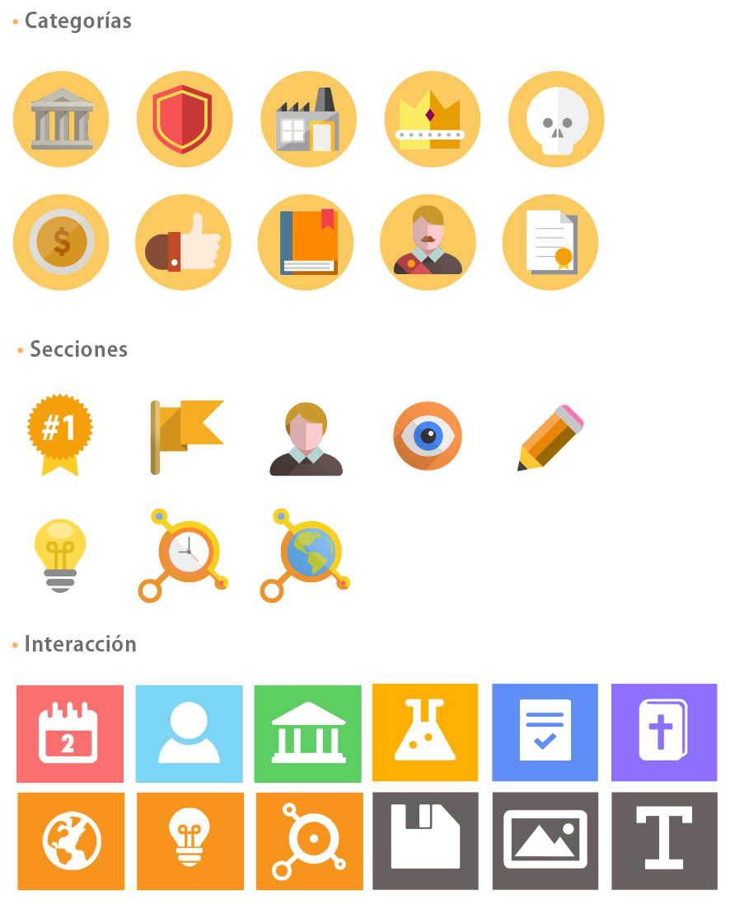

# Iconos

Se utilizan iconos coloridos y simples para que la plataforma posea una aspecto ameno, amigable, sea atractivo y de fácil lectura para el estudiante de enseñanza básica.

Los iconos se distinguen de acuerdo a la función que cumplen en el sitio, sea este para identificar elementos de interacción como otros de función ilustrativa.

* **Categorías**
* **Secciones**
* **Interacción**

 

