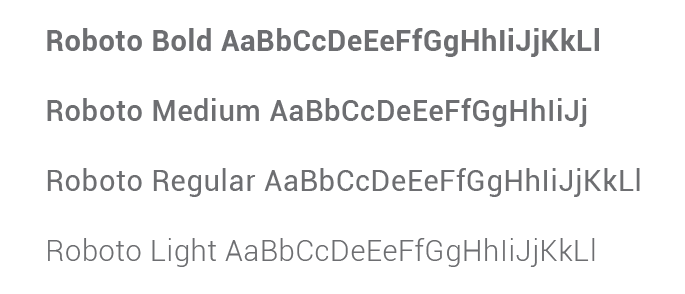
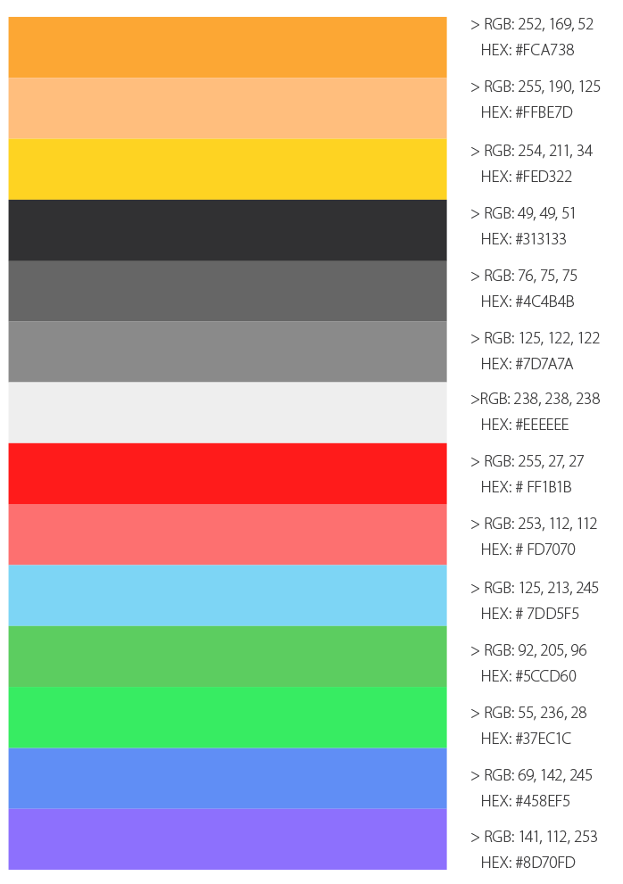
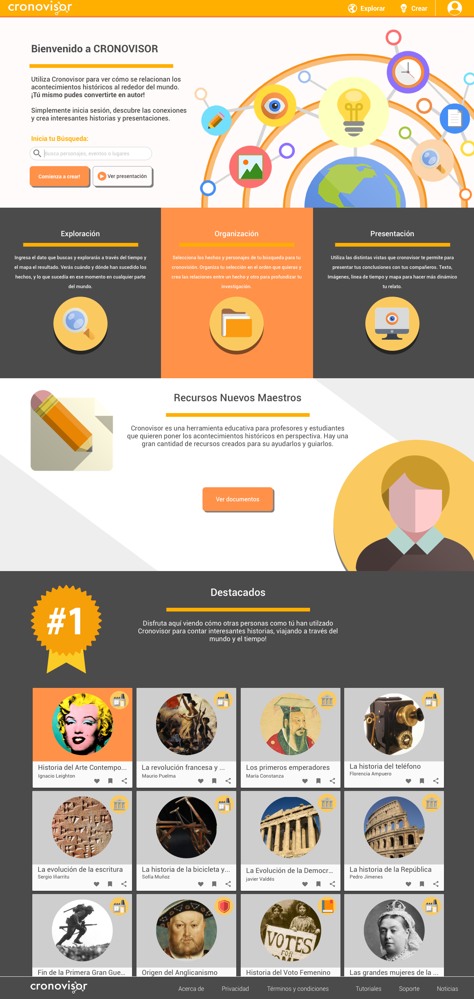

# Diseño de Interfaz

La propuesta de diseño de interfaz presenta mejoras con respecto a los wireframes anteriores aplicando los estilos de texto y color mencionados anteriormente.

En este aspecto se logra determinar los recursos de color aplicados para jerarquizar, y enfatizar las acciones del usuario mediante el resalte de los botones en acción en la pantalla de la plataforma. Así como aplicar el estilo iconográfico de esta.

También es importante remarcar que es en esta etapa en que se mejora el proceso de interac- ción de la plataforma con el usuario, pues son las **jerarquías de color, tamaño y colo**r los elementos que guían la vista del usuario y por ende conducen al usuario para utilizar correctamente la plataforma virtual.

## Tipografía

Tipografía Roboto (versiones Bold, Medium, Regular y Light) Se aplica tanto para Títulos y texto.

El sitio utiliza la tipografía sans serif, considerando su legibilidad, simpleza, y versatilidad, especial para plataformas digitales. De esta manera, se elige la tipografía Roboto en las mensionadas variantes, aplicando distintos tamaños y color, según la paleta elegida, para generar jerarquías de lectura y facilitar su lectura.

 

### Estilos de texto

* 
**H1**: Roboto Bold, 24 pt cuerpo , color #4C4B4B y #FFFFFF.
* 
**H2**: Roboto Medium, 18 pt cuerpo, color #4C4B4B y #FFFFFF. 
* 
**H3**: Roboto Medium, 14 pt cuerpo, color #4C4B4B y #FFFFFF. 
* 
**Párrafo bási**co: Roboto Regular, 14 pt cuerpo, color #7D7A7A. 
* 
**Menu**́: Roboto Bold, 18 pt cuerpo, color #FFFFFF.
* 
**Textos menores**: Roboto Light, 13 pt cuerpo, color #7D7A7A.

## Paleta Cromática

La paleta cromática se basa en la armonía de los colores gris y naranjo, pues ambos están relacionados con la estabilidad, el naranjo con la alegría y juventud, así como el gris con la paz y tenacidad, todo esto en sobre un manto blanco de fondo.

Se consideran los grises principalmente para los textos, y objetos apagados, y al naranjo como color de iconos y objetos activos.

 

### Maquetas

* 
**home*** 

descripción y promoción del sitio.

 

* 
**explorar*** 

 selección de explorar elementos o cronovisiones.

 

* 
**cronovisiones*** 

visualización de presentaciones realizadas.

 

* 
**home*** 

descripción y promoción del sitio.

 

* 
**home*** 

categorías: selección de cronovisiones por temas..

 

* 
**home*** 

búsqueda: ingreso de datos, sea evento, personaje, lugar o año.

 

* 
**home*** 

elementos: resultado de búsqueda, vista de un hecho o personaje, selección de temas.

 

* 
**home*** 

vista elemento: visualización de un elemento con texto, imágen y mapa.
 

* 
**home*** 

solo imagen: visualización de un elemento solo de imagen.

 

* 
**home*** 

selección elemento: el botón agregar brilla cuando un elemento completo es seleccionado.

 

* 
**home*** 

selección texto: el usuario puede seleccionar una parte del texto para su cronovisión.

 

* 
**home*** 

selección imágen: el usuario puede seleccionar solo la imagen para su cronovisión.

 

* 
**home*** 

noti cación: el sistema avisa al usuario que sus elementos han sido guardados.

 

* 
**home*** 

noti cación: el sistema avisa al usuario que sus elementos han sido guardados.

 

* 
**edición imagen*** 

vista de la edición de una imagen.

 

* 
**edición imagen*** 

vista de la edición de una imagen.

 

* 
**presentación**

visualización de una cronovisión integrada por textos, imágenes y elementos, todos relaciona- dos y unidos los puntos que la componen.