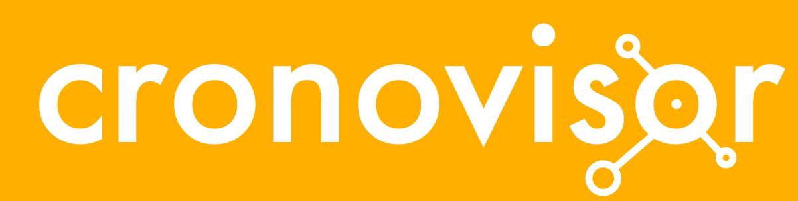

# logotipo

El diseño visual como fase que busca apelar a la emocionalidad en el usuario, también busca comunicarse con él, a través del color y las formas, para facilitar el uso y la realización de acciones en la plataforma digital.

El proyecto (*Historia en Simultáneo*) se nombró como **cronovisor**, del griego *cronos* que significa tiempo, y *visor* pues visualiza en un ámbito geográfico el tiempo y los acontecimientos consultados.

Esta propuesta está inspirada en la representación grá ca que utiliza la plataforma, es decir, en la **conexión de puntos de la historia**, por ello la presentación es el objeto central unido a distintos puntos o elementos que la conforman.

Se utiliza una tipografía robusta y uniforme para facilitar la lectura y visibilidad utilizando la fuente **Futura** en minúscula, integrando el isotipo en ella, todo en blanco para crear contraste con el fondo siendo el **Naranjo # FFAF00** el color o cial de la plataforma.

 

*el centro representa un elemento particular y los círculos menores las relaciones o conexiones que se establecen. *

 

