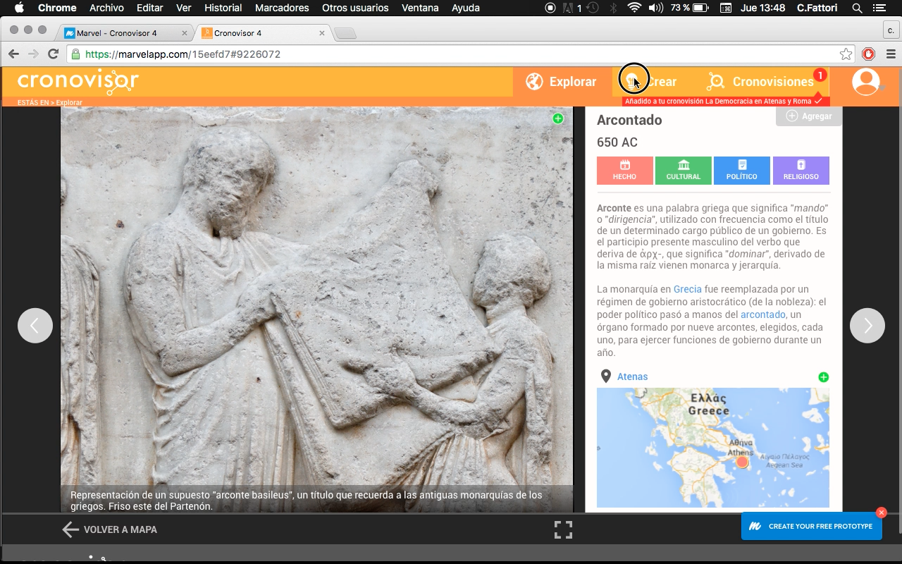

# Prueba de Usuario

Esta prueba consiste en el desarrollo de una maqueta virtual del sitio, que sea navegable, para que un evaluador, que debe cumplir con los requisitos realizados en el **caso de uso **simulado anteriormente, interactúe con el sitio y poder observar, al tiempo que lo usa, cuáles son** las fallas** que el sitio posee.

En esta prueba se le da a la estudiante una breve serie de tareas específicas que debe realizar **sin intervención** de nadie. El objetivo es notar en qué momento el usuario tiene una dificultad con respecto a la interfaz del sitio, si tarda mucho en hacer una tarea, si le resulta difícil encontrar una sección, etc.

Se le pide que navegue por el sitio y minetras lo hace que comente en voz alta, lo que identi ca, lo que no entiende, las cosas que le causen con icto o le molesten. Se le explica que es una maque- ta navegable, así que no puede hacer scroll o click a todo lo que vea, que sólo unos elementos de la maqueta están activos para su uso.

Las tareas que el usuario debió realizar son las siguientes:

* Identificar de qué trata el sitio y para qué sirve
* Identificar los elementos de exploración
* Ingresar datos de búsqueda
* Seleccionar un elemento y agregar a su presentación
* Editar presentación

## Datos del Usuario

* 
**Nombre de la alumna**: Yaney Alexandra Vidal Medina Edad: 12 años
* 
**Curso**: 7 mo
* 
**Colegio**: Sara Cruchaga

La alumna trabaja usando como power point, o ce microsoft, google para buscar trabajos de historia información, buscando a través de preguntas.

### Identificar de qué trata el sitio y para qué sirve

Reconoce que el sitio es educativo, que sirve para investigar, recorrer un mapa, crear presentaciones para mostrar en clases, que hay “cosas” para los profesores y unas presentaciones al  final.

### Identificar los elementos de exploración

Tiene dificultad para notar qué elemento está en seleccionado en la parte central de la exploración. hay que resaltar más cuando un elemento está centrado en la linea de tiempo.

Tiene dificultad en identificar los elementos de búsqueda no reconoce bien en qué está, luego de un tiempo identifica los hechos y personajes, y la capacidad de verlos por tema.

### Ingresar datos de búsqueda

Tiene una ligera confusión en el ingreso de datos de búsqueda, al principio trata en la sección explorar, luego se da cuenta de la barra de buscar.

### Seleccionar un elemento y agregar a su presentación

No presenta dificultad en la selección de elementos para su presentación, identfica claramente los botones de agregar imagen, mapa, texto o elemento. Y cuando estos se agregan a su cronovisión.

La sección de crear debe ser donde el usuario debe editar la presentación con los elementos recién guardados, la sección cronovisones está mal enfocada pues aquí es donde deberían estar las cronovisiones  finalizadas.

### Editar presentación

Identifica correctamente los botones para editar pues al realizar presentaciones con power point está familiarizada con los botones de interacción y las cosas que puede hacer aquí.